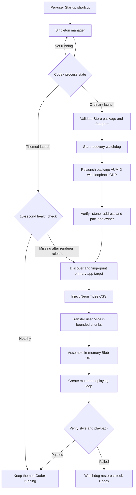

# Neon Tides for Codex

[简体中文](README.zh-CN.md) · [Security](SECURITY.md) · [Changelog](CHANGELOG.md)

> [!WARNING]
> Neon Tides is an experimental, Windows-only, unofficial compatibility layer.
> It keeps a loopback Chromium DevTools endpoint open while themed Codex is
> running. Read the [security section](#security) before installing.

Neon Tides gives the Microsoft Store Codex desktop app a teal-and-magenta glass
interface over **your own muted, looping MP4 background**.

It does not patch or redistribute files from the signed Codex application
package. A per-user manager detects ordinary Codex launches, relaunches the app
with a loopback debugging endpoint, injects the theme at runtime, verifies video
playback, and restores a stock launch when injection fails.

OpenAI's documented Appearance settings cover base themes, accent/background/
foreground colors, contrast, and fonts. Neon Tides goes beyond those documented
controls through runtime CDP injection; it is not an official theme or video-
background API. See the
[official Appearance documentation](https://learn.chatgpt.com/docs/reference/settings#appearance).

## Highlights

- Uses a local MP4 that you select during installation; no wallpaper is bundled.
- Forces the background to autoplay, remain muted, and loop continuously.
- Adds translucent teal, deep-blue, and magenta surfaces throughout the primary
  Codex window.
- Verifies CSS, the video layer, loop state, mute state, and active playback.
- Checks renderer health every 15 seconds and reinjects after a page/target
  recreation.
- Uses a randomized high-numbered port bound to `127.0.0.1`.
- Validates the Store package, signed executable, port owner, loopback endpoint,
  and signed Node.js runtime before injection.
- Includes startup persistence, status reporting, watchdog recovery, reversible
  disable, and a manifest-guarded purge option.
- Contains no OpenAI binaries, personal media, screenshots, credentials, or
  machine-specific runtime results.

## Requirements

- Windows 11 x64.
- The Microsoft Store desktop package named `OpenAI.Codex`.
- Windows PowerShell 5.1 (included with Windows 11).
- A signed OpenJS Foundation Node.js 22+ runtime. The installer can discover the
  compatible runtime bundled with Codex after a local Codex task has run, or an
  official system Node.js installation in `PATH`.
- A local MP4 file, from 1 KiB through 64 MiB, that you created, own, or are
  licensed to use.

Recommended video profile:

| Setting | Recommendation |
|---|---|
| Container | MP4 |
| Codec | H.264/AVC |
| Pixel format | `yuv420p` |
| Resolution | 1920×1080 |
| Frame rate | 24–30 FPS |
| Audio | Not needed; playback is always muted |
| Size | Preferably below 40 MiB; hard limit 64 MiB |

4K/60 FPS works on the validated machine, but it consumes more memory, GPU time,
battery, and startup time.

## Install

Download the repository ZIP or clone it:

```powershell
git clone https://github.com/xlp294697-crypto/codex-neon-tides.git
Set-Location .\codex-neon-tides
```

Close every Codex window and let active local tasks finish. Then run:

```powershell
powershell.exe -NoProfile -ExecutionPolicy Bypass -File .\Install-NeonTides.ps1 `
  -BackgroundVideo "C:\Videos\my-background.mp4"
```

Open Codex normally after the installer completes. The first launch will close
and reopen once while the manager converts it into a themed launch. Initial
application usually takes 20–90 seconds, depending on media size and machine
speed.

No administrator privileges are required.

The installer:

1. validates the Codex package, MP4 container/size, and signed Node runtime;
2. chooses an unused high loopback port;
3. copies only reviewed runtime files and a private copy of your video to
   `%LOCALAPPDATA%\NeonTidesForCodex`;
4. records the video hash and selected port in `install-manifest.json`;
5. creates the per-user startup shortcut
   `%APPDATA%\Microsoft\Windows\Start Menu\Programs\Startup\Neon Tides for Codex.lnk`;
6. starts a singleton background manager for the current sign-in session.

Your original video is never modified. Re-running the installer with another
MP4 changes the installed copy. Close Codex before doing so.

### If Node is not found

First open Codex and run one local task, then try the installer again. This
normally creates the Codex bundled runtime cache. Alternatively install an
official Node.js 22+ Windows build and make `node.exe` available in `PATH`.

The installer intentionally rejects an unsigned or unexpectedly signed
`node.exe`, even when it reports a compatible version.

## Check status

```powershell
powershell.exe -NoProfile -ExecutionPolicy Bypass -File .\Get-NeonTidesStatus.ps1
```

Example fields:

```json
{
  "installed": true,
  "startup_link_exists": true,
  "disabled": false,
  "loopback_listener": true,
  "manager_status": "active"
}
```

Manager states:

| State | Meaning |
|---|---|
| `watching` | Manager is running and waiting for Codex. |
| `injecting` | A normal launch is being converted and injected. |
| `active` | CSS and video playback were verified. |
| `repairing` | Renderer state was missing; in-place reinjection is running. |
| `degraded` | Health/repair failed and will be retried. |
| `backoff` | Full launch injection failed; retry is temporarily delayed. |
| `disabled` | The local disable marker is present. |
| `error` | Manager stopped after an unexpected error. |

## How it works



The runtime is split into four trust boundaries:

1. **Installer and manifest** — validates inputs, chooses the port, copies the
   release, and creates an installation-specific startup shortcut.
2. **Compatibility launcher** — verifies Store identity, signature, AUMID,
   process paths, listener ownership, and CDP transport before any media is
   transferred.
3. **Injector** — accepts only the expected loopback HTTP/WebSocket endpoints,
   fingerprints the primary `app:` target, injects CSS, and sends the MP4 in
   384 KiB chunks. The renderer assembles an in-memory Blob URL.
4. **Manager and watchdog** — verifies the full effect, repairs renderer-only
   reloads, and returns to a normal non-CDP launch if initial injection does not
   complete.

## Security

### Unauthenticated local DevTools access

The themed app keeps a CDP endpoint on a random port at `127.0.0.1`. The
endpoint is not reachable from another computer by default, but CDP itself has
no authentication. Any untrusted process already running on the same computer
may be able to find the port, inspect rendered Codex content, or modify the UI.

Randomizing the port lowers accidental conflicts; it does **not** make CDP a
secure authenticated service.

Use Neon Tides only on a trusted single-user computer. Never:

- change the debug address to `0.0.0.0`, a LAN address, or a public interface;
- expose the selected port through Windows Firewall, a router, SSH, a tunnel,
  or remote-development tooling;
- enable the theme on a shared workstation or a machine that runs untrusted
  local software.

Read [SECURITY.md](SECURITY.md) for the complete threat model.

### Codex restarts

Applying, reconfiguring, disabling, or recovering the theme can close every
Codex package process. Finish active tasks and close Codex before those
operations. After a graceful-close timeout, the safety probe may force-close
validated processes inside the signed package so a failed debug instance is not
left behind.

### Privacy and media rights

The injector makes no non-loopback network request. Your installed MP4 remains
on the computer and is copied into renderer memory through the local endpoint.
The installed copy is unencrypted.

This repository does not distribute a demo wallpaper. You must supply media you
created, own, or have permission to use. The MIT license for this repository
does not grant rights to wallpaper sites, stock footage, movies, music videos,
or any other third-party media.

Runtime JSON may contain local install paths, package versions, PIDs, hashes,
and timestamps. Redact it before posting a public issue.

## Compatibility

This project relies on implementation details of the Windows desktop app. Only
the following configuration has been directly validated:

| Component | Validated configuration | Result |
|---|---|---|
| Operating system | Windows 11 build 26200 | Verified |
| Codex package | `OpenAI.Codex` `26.818.5345.0` | Verified |
| Windows PowerShell | `5.1.26100.9168` | Verified |
| Node.js | Signed bundled Node `24.19.0` | Verified |
| Video | H.264 MP4, 3840×2160, 60 FPS, about 26 MiB | Verified |
| Ordinary full relaunch | Manager-driven injection | Verified |
| Renderer/page recreation | Health check + in-place reinjection | Component-tested; full recovery depends on the installed Codex build |
| Windows sign-in startup | Per-user Startup shortcut | Structurally verified |
| Secondary/pop-out windows | Not fully covered | Partial |
| Windows 10 | Not tested | Unknown |
| macOS, Linux, web, CLI, IDE extension | Different architecture | Unsupported |

A later Codex release may change process behavior, target discovery, internal
class names, or DOM structure. Compatibility is best-effort and may break
without warning.

## Known limitations

- This is not an official theme, plugin, extension, or documented API.
- The primary Codex window briefly closes and reopens when an ordinary launch
  is converted into a themed launch.
- The entire video is held in Node memory and then renderer memory. Temporary
  peak usage is higher than the MP4 size.
- A renderer repair retransfers the complete MP4, so large videos recover more
  slowly.
- The video is always muted; audio is intentionally unsupported.
- High-resolution/high-frame-rate video increases memory, GPU use, heat, and
  battery drain.
- The injector targets the primary app window. Secondary, pop-out, and special-
  purpose windows may keep the stock appearance.
- The Startup shortcut runs only after the current user signs in to Windows.
- Managed enterprise devices may block scripts, AppX inspection, activation
  arguments, WMI process creation, or local debugging endpoints.
- The current implementation honors `prefers-reduced-motion` for CSS animation,
  but it does not automatically pause the background video.

## Troubleshooting

### Codex opens but no video appears

1. Wait up to 90 seconds after the first launch.
2. Run `Get-NeonTidesStatus.ps1` and check the manager state.
3. Open `%LOCALAPPDATA%\NeonTidesForCodex` and inspect the newest
   `injection-result-*.json` or `repair-result-*.json`.
4. A complete success must have `classification: APPLIED` and all of these set
   to `true`: `theme_applied`, `style_verified`, `background_verified`,
   `video_loop_verified`, `video_muted_verified`, and
   `video_playback_verified`.
5. Try a smaller H.264 1080p/30 FPS MP4.
6. Close Codex and run the installer again with the replacement video.

Optional FFmpeg conversion:

```powershell
ffmpeg -i ".\input.mp4" -vf "scale=-2:1080" -r 30 -c:v libx264 `
  -pix_fmt yuv420p -an -movflags +faststart ".\background-compatible.mp4"
```

FFmpeg is optional and is not bundled.

### Codex returns to the stock appearance

The watchdog probably recovered from an incomplete injection. Look for:

- `DEBUG_ENDPOINT_TIMEOUT`
- `MAIN_TARGET_NOT_FOUND`
- `THEME_VERIFICATION_FAILED`
- `WATCHDOG_RECOVERY`
- `INJECTION_WORKER_FAILED`

Do not repeatedly force-launch a failed themed instance; stock recovery is a
safety feature.

### Port conflict

The selected port is stored in:

```text
%LOCALAPPDATA%\NeonTidesForCodex\install-manifest.json
```

The installer normally chooses a free high port. If a later process occupies
it, close the owning application normally or reinstall while Codex is closed to
select another port. Do not terminate an unknown process merely to free a port,
and never resolve the problem by binding CDP to a network interface.

### A Codex update broke the theme

Collect sanitized versions and booleans:

```powershell
Get-AppxPackage -Name OpenAI.Codex | Select-Object Name, Version, Status
node --version
.\Get-NeonTidesStatus.ps1
```

When opening an issue, include the Windows build, Codex version, Node version,
video codec/resolution/size, injection classification, and whether stock
recovery succeeded. Remove user names, absolute local paths, task/chat content,
and credentials.

## Disable or uninstall

Disable the manager, remove its startup shortcut, and restore a stock Codex
launch while keeping installed files:

```powershell
powershell.exe -NoProfile -ExecutionPolicy Bypass -File .\Uninstall-NeonTides.ps1
```

Disable, restore stock Codex, and remove the manifest-validated default install:

```powershell
powershell.exe -NoProfile -ExecutionPolicy Bypass -File .\Uninstall-NeonTides.ps1 -Purge
```

The uninstaller does not touch your original source video, chats, Codex
settings, repositories, or the signed app package. `-Purge` refuses to recurse
through arbitrary/custom paths and deletes only known Neon Tides files from the
default installation directory.

## Development

Run the release checks before committing:

```powershell
.\tests\Validate-Release.ps1
```

The check parses every PowerShell script, runs `node --check` on the injector,
verifies release markers, and rejects media, Windows shortcuts, private-path
signatures, and common credential patterns.

The GitHub Actions workflow performs the same checks on `windows-latest`.

## Project status

Neon Tides is experimental. Focused compatibility fixes are welcome. Please do
not submit personal background videos, private chat screenshots, unredacted
diagnostics, authentication files, cookies, tokens, OpenAI application
packages, or proprietary product assets.

## License and non-affiliation

Original source and documentation are available under the [MIT License](LICENSE).
See [NOTICE.md](NOTICE.md) for attribution and trademark notices.

This independent project is not affiliated with, endorsed by, sponsored by,
maintained by, or supported by OpenAI.
