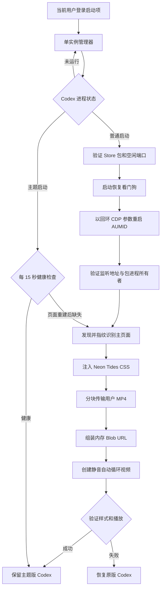

# Neon Tides for Codex

[English](README.md) · [安全说明](SECURITY.md) · [更新记录](CHANGELOG.md)

> [!WARNING]
> Neon Tides 是仅面向 Windows 的实验性、非官方兼容层。主题版 Codex
> 运行期间会开放一个仅限本机回环地址的 Chromium DevTools 调试端点。
> 安装前请先阅读[安全风险](#安全风险)。

Neon Tides 会把 Microsoft Store 版 Codex 桌面应用改造成青色与洋红色的
半透明玻璃界面，并在背后循环播放**你自己选择的本地 MP4**。视频强制
静音，不会随仓库分发。

本项目不修改、不打包、也不重新分发已签名 Codex 应用包中的文件。它通过
每用户后台管理器识别普通 Codex 启动，以本机 CDP 模式重启应用、运行时
注入主题、验证视频播放，并在注入失败时恢复原版 Codex。

OpenAI 官方 Appearance 文档公开的外观能力包括基础主题、强调色、背景色、
前景色、对比度和字体。Neon Tides 使用运行时 CDP 注入实现官方文档范围以外
的视频背景；它不是官方主题或视频背景 API。参见
[OpenAI 官方外观设置文档](https://learn.chatgpt.com/docs/reference/settings#appearance)。

## 主要功能

- 安装时选择自己的 MP4；仓库不附带任何壁纸或示例视频。
- 视频自动播放、始终静音、连续循环。
- 主窗口使用深海蓝、霓虹青、洋红色的半透明玻璃层。
- 同时验证 CSS、视频层、循环、静音和实际播放状态。
- 每 15 秒检查渲染页面；内部刷新或 target 重建后会自动补注入。
- 每次安装随机选择高位端口，并且只绑定 `127.0.0.1`。
- 注入前验证 Store 包身份、可执行文件签名、端口所有者、回环端点和已签名
  Node.js。
- 包含登录启动、状态查询、失败看门狗、可逆禁用和受 manifest 约束的清理。
- 公开版本不包含 OpenAI 二进制、个人视频、截图、凭证、本机路径或运行日志。

## 环境要求

- Windows 11 x64。
- Microsoft Store 安装的 `OpenAI.Codex` 桌面包。
- Windows PowerShell 5.1（Windows 11 自带）。
- OpenJS Foundation 有效签名的 Node.js 22 或更高版本。安装器可寻找运行过
  本地 Codex 任务后产生的内置 Node，也可使用 `PATH` 中的官方 Node.js。
- 1 KiB 到 64 MiB 的本地 MP4；你必须拥有或获准使用该视频。

推荐视频参数：

| 项目 | 建议值 |
|---|---|
| 容器 | MP4 |
| 编码 | H.264/AVC |
| 像素格式 | `yuv420p` |
| 分辨率 | 1920×1080 |
| 帧率 | 24–30 FPS |
| 音频 | 不需要，始终静音 |
| 文件大小 | 建议小于 40 MiB，硬上限 64 MiB |

已经验证 4K/60 FPS 视频可以运行，但内存、显卡、功耗和初次注入耗时都会
明显增加。

## 安装

下载仓库 ZIP，或者克隆仓库：

```powershell
git clone https://github.com/xlp294697-crypto/codex-neon-tides.git
Set-Location .\codex-neon-tides
```

先关闭所有 Codex 窗口，并等待本地任务结束。然后执行：

```powershell
powershell.exe -NoProfile -ExecutionPolicy Bypass -File .\Install-NeonTides.ps1 `
  -BackgroundVideo "C:\Videos\my-background.mp4"
```

安装结束后按平常方式打开 Codex。首次启动时应用会关闭并重开一次，管理器
借此切换为主题模式。根据视频大小和电脑速度，通常需要 20–90 秒。

不需要管理员权限。

安装器会：

1. 验证 Codex Store 包、MP4 容器与大小、已签名 Node 运行时；
2. 选择一个空闲的高位回环端口；
3. 将审核过的运行文件和视频私有副本复制到
   `%LOCALAPPDATA%\NeonTidesForCodex`；
4. 在 `install-manifest.json` 保存端口与视频哈希；
5. 建立当前用户的登录启动快捷方式
   `%APPDATA%\Microsoft\Windows\Start Menu\Programs\Startup\Neon Tides for Codex.lnk`；
6. 立即启动单实例后台管理器。

原视频不会被修改。若要换背景，请关闭 Codex 后，用另一份 MP4 重新运行
安装器。

### 找不到 Node 时

先在 Codex 中运行一次本地任务，再重试安装。这样通常会生成 Codex 内置
运行时缓存。也可以安装官方 Node.js 22+ Windows 版本并把 `node.exe` 放入
`PATH`。

即使版本号满足要求，安装器也会拒绝未签名或签名主体异常的 `node.exe`。

## 查看状态

```powershell
powershell.exe -NoProfile -ExecutionPolicy Bypass -File .\Get-NeonTidesStatus.ps1
```

完整成功时，常见字段如下：

```json
{
  "installed": true,
  "startup_link_exists": true,
  "disabled": false,
  "loopback_listener": true,
  "manager_status": "active"
}
```

管理器状态含义：

| 状态 | 含义 |
|---|---|
| `watching` | 管理器运行中，等待 Codex。 |
| `injecting` | 正在把普通启动转换为主题启动。 |
| `active` | CSS 和视频播放均已验证。 |
| `repairing` | 页面状态丢失，正在原地补注入。 |
| `degraded` | 健康检查或修复失败，稍后重试。 |
| `backoff` | 完整启动注入失败，暂时退避。 |
| `disabled` | 本地禁用标记存在。 |
| `error` | 管理器因意外错误停止。 |

## 工作原理



关键边界：

1. **安装器与 manifest**：验证输入、选择端口、复制发行文件，并建立带安装
   标识的快捷方式。
2. **兼容启动器**：媒体传输前验证 Store 身份、签名、AUMID、进程路径、
   监听所有者与 CDP 传输。
3. **注入器**：只接受预期回环 HTTP/WebSocket 地址，指纹识别主 `app:`
   页面，注入 CSS，并以 384 KiB 分块发送 MP4；页面端组装内存 Blob URL。
4. **管理器与看门狗**：验证完整效果、修复仅渲染页面重载，并在首次注入未
   完成时回到无 CDP 的正常 Codex。

## 安全风险

### 无认证的本机调试端点

主题版应用会在 `127.0.0.1` 的随机高位端口保留 CDP。默认情况下其他电脑
无法直接访问，但 CDP 自身没有认证。同一电脑上的不可信进程可能找到端口、
读取当前渲染的 Codex 内容或操纵界面。

随机端口只减少意外冲突，**不等于身份认证或安全隔离**。

本项目只适合可信的单用户电脑。绝对不要：

- 把调试地址改成 `0.0.0.0`、局域网或公网地址；
- 通过防火墙、路由器、SSH、隧道或远程开发工具暴露端口；
- 在共享电脑、公共终端或会运行不可信本地软件的环境启用。

完整威胁模型见 [SECURITY.md](SECURITY.md)。

### Codex 会被重启

应用主题、更换背景、禁用或故障恢复时，可能关闭整个 Codex 包的进程。
操作前请结束活动任务并关闭 Codex。在优雅退出超时后，安全探针可能强制
关闭已验证的包内进程，避免失败的调试实例残留。

### 隐私与媒体版权

注入器不发出非回环网络请求。视频只保存在本机，并经回环端点进入本地
Codex 渲染进程。安装副本不加密。

仓库不分发演示壁纸。你必须使用自己创作、拥有或获准使用的视频。仓库的
MIT 许可证不会授予第三方壁纸站、素材、影视、音乐视频等内容的权利。

运行 JSON 可能包含本地安装路径、包版本、PID、哈希和时间。发布 issue 前
必须脱敏。

## 兼容性

项目依赖 Windows 桌面应用内部实现。目前直接验证的环境：

| 组件 | 已验证环境 | 结果 |
|---|---|---|
| 操作系统 | Windows 11 build 26200 | 已验证 |
| Codex 包 | `OpenAI.Codex` `26.818.5345.0` | 已验证 |
| Windows PowerShell | `5.1.26100.9168` | 已验证 |
| Node.js | 有效签名的内置 Node `24.19.0` | 已验证 |
| 视频 | H.264 MP4，3840×2160，60 FPS，约 26 MiB | 已验证 |
| 应用完整重开 | 管理器自动注入 | 已验证 |
| 页面/renderer 重建 | 健康检查与原地补注入 | 已做组件测试；完整恢复仍取决于本机 Codex 版本 |
| Windows 登录启动 | 当前用户 Startup 快捷方式 | 已验证结构 |
| 副窗口/弹出窗口 | 未完整覆盖 | 部分 |
| Windows 10 | 未测试 | 未知 |
| macOS、Linux、网页、CLI、IDE 扩展 | 架构不同 | 不支持 |

后续 Codex 更新可能更改启动行为、target 发现、内部类名或 DOM。未列出的
版本只能尽力兼容，可能在无预告的情况下失效。

## 已知限制

- 不是官方主题、插件、扩展或受文档支持的 API。
- 普通 Codex 启动会短暂关闭并重开一次。
- 视频完整保存在 Node 和 renderer 内存，瞬时峰值高于 MP4 文件大小。
- 页面修复会重新传输完整 MP4，大视频恢复较慢。
- 视频始终静音，不支持音频。
- 高分辨率或高帧率会增加内存、GPU、温度和电池消耗。
- 主要目标是主窗口，副窗口、弹出窗口或特殊窗口可能保留原样。
- 登录启动项只在当前用户登录 Windows 后运行。
- 企业设备可能阻止 PowerShell、AppX 检查、WMI 或本机调试端点。
- CSS 动画会尊重 `prefers-reduced-motion`，但视频目前不会自动暂停。

## 故障排查

### Codex 打开后没有视频

1. 首次启动等待最多 90 秒。
2. 运行 `Get-NeonTidesStatus.ps1` 查看管理器状态。
3. 检查 `%LOCALAPPDATA%\NeonTidesForCodex` 中最新的
   `injection-result-*.json` 或 `repair-result-*.json`。
4. 完整成功必须为 `classification: APPLIED`，并且以下字段全是 `true`：
   `theme_applied`、`style_verified`、`background_verified`、
   `video_loop_verified`、`video_muted_verified`、
   `video_playback_verified`。
5. 尝试更小的 H.264 1080p/30 FPS MP4。
6. 关闭 Codex，再用替换视频重新安装。

可选 FFmpeg 转换命令：

```powershell
ffmpeg -i ".\input.mp4" -vf "scale=-2:1080" -r 30 -c:v libx264 `
  -pix_fmt yuv420p -an -movflags +faststart ".\background-compatible.mp4"
```

项目不附带 FFmpeg。

### 自动恢复成原版界面

看门狗可能因注入未完成而恢复正常应用。可检查：

- `DEBUG_ENDPOINT_TIMEOUT`
- `MAIN_TARGET_NOT_FOUND`
- `THEME_VERIFICATION_FAILED`
- `WATCHDOG_RECOVERY`
- `INJECTION_WORKER_FAILED`

不要反复强制启动失败的主题实例；恢复原版是安全功能。

### Codex 更新后失效

收集脱敏后的环境信息：

```powershell
Get-AppxPackage -Name OpenAI.Codex | Select-Object Name, Version, Status
node --version
.\Get-NeonTidesStatus.ps1
```

提交 issue 时附上 Windows build、Codex 版本、Node 版本、视频编码/分辨率/
大小、注入分类和原版恢复是否成功。删除用户名、绝对路径、任务/对话内容和
所有凭证。

## 禁用与卸载

停止管理器、移除登录启动项并恢复原版 Codex，但保留安装文件：

```powershell
powershell.exe -NoProfile -ExecutionPolicy Bypass -File .\Uninstall-NeonTides.ps1
```

恢复原版并删除 manifest 验证过的默认安装：

```powershell
powershell.exe -NoProfile -ExecutionPolicy Bypass -File .\Uninstall-NeonTides.ps1 -Purge
```

卸载器不会删除原始视频、聊天、Codex 设置、代码仓库或已签名应用包。
`-Purge` 不会递归删除任意/自定义目录，只删除默认安装目录中的已知
Neon Tides 文件。

## 开发与验证

提交前运行：

```powershell
.\tests\Validate-Release.ps1
```

检查会解析所有 PowerShell、对 Node 注入器运行语法检查、验证发行标记，并
拒绝媒体、Windows 快捷方式、个人路径和常见凭证特征。GitHub Actions 会在
`windows-latest` 上执行同一检查。

欢迎提交范围清晰的兼容性修复。请勿上传个人背景视频、私人对话截图、未
脱敏日志、认证文件、Cookie、令牌、OpenAI 应用包或专有产品素材。

## 许可证与非隶属声明

本仓库原创代码和文档使用 [MIT License](LICENSE)。署名和商标说明见
[NOTICE.md](NOTICE.md)。

本项目是独立社区项目，与 OpenAI 没有隶属关系，也未得到 OpenAI 的认可、
赞助、维护或支持。
